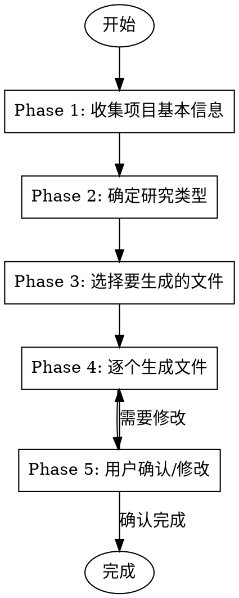
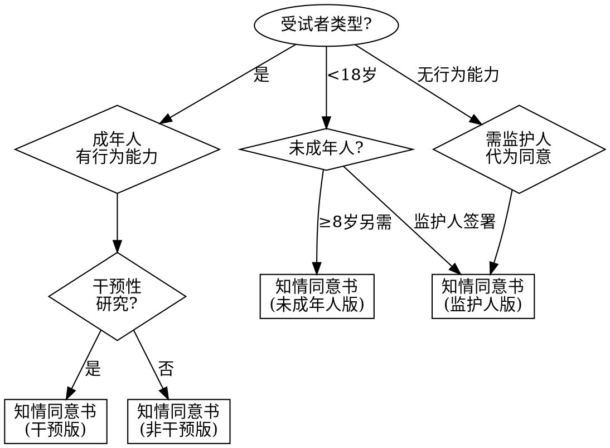

# 伦理审查申请材料撰写助手

## Overview

帮助研究者高效撰写涉及人的生物医学伦理审查申请材料。通过结构化问答收集项目信息，基于官方模板生成规范的申请文档，保留原模板格式。

**模板目录**: `/Users/chenzheyi/Desktop/Document_M1/涉及人的生物医学伦理审查申请/`

## When to Use

- 需要撰写伦理审查申请材料
- 准备新研究项目的伦理申报
- 需要生成知情同意书、研究方案等文件
- 填写伦理审查各类申请表

**不适用于**：已有完整材料只需格式转换、非伦理相关文档

## 核心工作流程



## Phase 1: 收集项目基本信息

**必须使用 AskUserQuestion 工具依次询问以下信息：**

### 第一轮问答 - 基本信息
1. **项目名称**：研究课题的完整名称
2. **研究类型**：
   - 干预性研究（药物/器械临床试验、手术干预等）
   - 非干预性研究（问卷调查、观察性研究、回顾性研究等）
3. **资金来源**：自筹/院内基金/省部级基金/国家级基金/企业资助

### 第二轮问答 - 研究者信息
1. **主要研究者（PI）**：姓名、职称、科室、联系方式
2. **研究团队成员**：姓名、职称、分工
3. **是否有GCP培训证书**

### 第三轮问答 - 研究设计
1. **研究目的**：主要研究目标
2. **研究方法**：简述技术路线
3. **样本量**：预计入组人数
4. **研究周期**：起止时间
5. **受试者人群**：
   - 是否包含未成年人
   - 是否包含无行为能力者
   - 纳入/排除标准概述

### 第四轮问答 - 风险与获益
1. **潜在风险**：可能的不良反应或风险
2. **风险控制措施**：如何保障受试者安全
3. **预期获益**：受试者可能获得的直接/间接获益
4. **是否有补偿**：受试者补偿方案

## Phase 2: 确定研究类型并推荐文件

根据收集的信息，确定适用的审查类型：

| 研究类型 | 适用审查指南 |
|---------|-------------|
| 药物/器械临床试验 | 指南一 |
| 一般生物医学研究 | 指南二 |
| 基金申报预审 | 指南三 |
| 新技术/新项目 | 指南四 |

## Phase 3: 选择要生成的文件

**使用 AskUserQuestion 让用户选择需要生成的文件（可多选）：**

### 初始审查必备文件
- [ ] 初始审查申请表
- [ ] 研究方案
- [ ] 知情同意书（根据类型选择）
- [ ] 主要研究者责任声明
- [ ] 研究者简历
- [ ] 利益冲突声明
- [ ] 伦理审查文件递交信
- [ ] 自查清单

### 备案类文件
- [ ] 临床研究项目备案表
- [ ] 研究团队名单
- [ ] 临床研究项目报送资料列表

### 后续审查文件
- [ ] 修正案审查申请表
- [ ] 年度/定期跟踪审查报告
- [ ] SAE报告表
- [ ] 违背/偏离方案报告
- [ ] 结题报告

## Phase 4: 生成文件

### 技术要求 - 保留原格式

**关键：必须保留Word模板的原有格式（字体、段落、表格样式）**

生成方法：

```python
# 使用 python-docx 库操作Word文档
from docx import Document

# 1. 读取模板文件
template_path = "/Users/chenzheyi/Desktop/Document_M1/涉及人的生物医学伦理审查申请/初始审查申请表.docx"
doc = Document(template_path)

# 2. 查找并替换占位符，保留原有格式
for paragraph in doc.paragraphs:
    for run in paragraph.runs:
        if "【项目名称】" in run.text:
            run.text = run.text.replace("【项目名称】", actual_project_name)

# 3. 处理表格中的内容
for table in doc.tables:
    for row in table.rows:
        for cell in row.cells:
            # 替换单元格内容，保留格式
            pass

# 4. 保存为新文件
output_path = f"/Users/chenzheyi/Desktop/Document_M1/涉及人的生物医学伦理审查申请/备案材料/{project_name}_初始审查申请表.docx"
doc.save(output_path)
```

### 文件生成顺序

1. **先生成研究方案** - 其他文件引用其内容
2. **再生成知情同意书** - 基于研究方案风险描述
3. **然后生成申请表** - 汇总项目信息
4. **最后生成声明类文件** - 标准化内容较多

### 模板文件对应表

| 文件类型 | 模板路径 |
|---------|---------|
| 初始审查申请表 | `初始审查申请表.docx` |
| 研究方案 | `研究方案.doc` |
| 知情同意书-干预 | `知情同意 干预.docx` |
| 知情同意书-非干预 | `知情同意 非干预.docx` |
| 知情同意书-监护人 | `知情同意 监护人.docx` |
| 知情同意书-未成年人 | `知情同意 未成年人.docx` |
| 研究者简历 | `研究者简历.docx` |
| 利益冲突声明 | `研究者利益冲突声明.docx` |
| PI责任声明 | `主要研究者责任声明.docx` |
| 自查清单 | `自查清单.docx` |
| 递交信 | `伦理审查文件递交信.docx` |
| 备案表 | `备案材料/2.临床研究项目备案表 5.2.docx` |
| 团队名单 | `备案材料/研究团队名单.docx` |

## Phase 5: 内容填写指南

### 研究方案核心章节

1. **研究背景** - 文献综述、研究必要性
2. **研究目的** - 主要目标、次要目标
3. **研究设计** - 类型、分组、盲法
4. **研究对象** - 纳入标准、排除标准、样本量计算
5. **研究方法** - 干预措施、检测指标、随访计划
6. **统计分析** - 分析方法、缺失数据处理
7. **质量控制** - 数据管理、监查计划
8. **伦理考量** - 知情同意、隐私保护、风险控制
9. **进度安排** - 时间节点、里程碑

### 知情同意书必备要素

根据《涉及人的生命科学和医学研究伦理审查办法》：

1. 研究目的和意义
2. 研究程序和方法
3. 预期参与时间
4. 可能的风险和不适
5. 可能的直接获益
6. 保密措施
7. 自愿参与和随时退出权利
8. 损害发生时的补救措施
9. 联系方式（研究者+伦理委员会）

### 知情同意书类型选择



## 输出文件命名规范

```
{项目简称}_{文件类型}_{版本号}_{日期}.docx

示例：
眼镜试戴量表_研究方案_V1.0_20241106.docx
眼镜试戴量表_知情同意书_V1.0_20241106.docx
```

## 常见错误提醒

| 错误类型 | 正确做法 |
|---------|---------|
| 知情同意书缺少伦理委员会联系方式 | 必须包含：0577-88075582, EYE_ec@126.com |
| 研究方案无版本号和日期 | 每份文件标注版本号（如V1.0）和日期 |
| 申请表与方案信息不一致 | 以研究方案为准，确保一致性 |
| 未勾选自查清单 | 提交前逐项核对8项要求 |
| 研究者简历缺GCP证书 | 涉及临床试验必须附GCP培训证明 |

## 提交前检查清单

使用 `自查清单.docx` 确认：
1. [ ] 所有文件版本号、日期一致
2. [ ] 研究方案与申请表信息对应
3. [ ] 知情同意书包含所有必备要素
4. [ ] 已签署利益冲突声明
5. [ ] 已签署PI责任声明
6. [ ] GCP证书在有效期内
7. [ ] 文件命名规范统一
8. [ ] 电子版与纸质版内容一致

## 联系信息

- **伦理委员会**: 0577-88075582
- **邮箱**: EYE_ec@126.com
- **国家医学研究登记备案系统**: https://www.medicalresearch.org.cn
